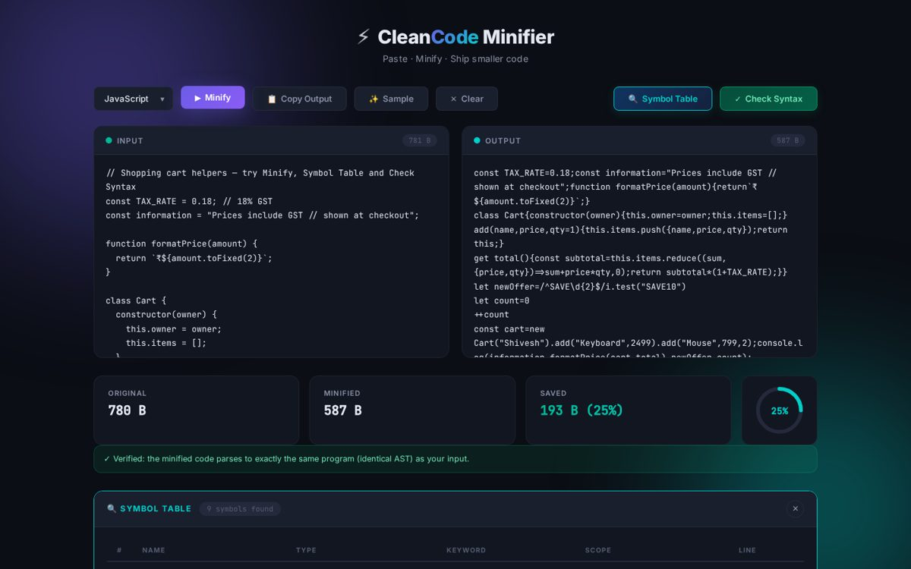

# ⚡ CleanCode Minifier

**Live demo → https://clean-code-minifiier.vercel.app**

Paste JavaScript or CSS, hit **Minify**, and ship smaller code — safely. CleanCode is a
compiler-style toolkit: a hand-written **lexer** turns your code into tokens, the
minifier rebuilds it without comments and redundant whitespace, and every JavaScript
result is **verified by re-parsing**: the output must produce exactly the same abstract
syntax tree (AST) as the input, or you are told it could not be verified.



## Features

| | |
|---|---|
| **JS minifier** | Token-based: strings, template literals (with nested `${}`), regex literals and comments are recognised, so `"https://…"` or `/\/\//` are never mangled. Line breaks are kept only where JavaScript's automatic semicolon insertion (ASI) needs them (`return⏎x`, `a⏎++b`, `let x = 1⏎let y`). |
| **AST verification** | The input and the output are both parsed with [acorn](https://github.com/acornjs/acorn) and compared node by node (positions ignored). A green ✓ means the program is provably unchanged. |
| **CSS minifier** | Context-aware: strips comments, collapses whitespace, drops the last `;` in a block — but keeps meaningful spaces (descendant selectors like `a :hover`, `calc(100% - 2px)`, `and (` in media queries) and leaves strings and `url()` untouched. |
| **Symbol table** | Lists variables, functions, arrow functions, classes, parameters, destructured names and imports with keyword, scope and line. |
| **Syntax checker** | Bracket matching that understands strings/regex/templates, plus a full ECMAScript parse that reports the exact line and column of the first error. Works for CSS braces too. |
| **Runs anywhere** | The same engine runs in the browser (nothing is uploaded) and behind an Express JSON API. |

### How it was tested

- `npm test` — 13 tests: regression cases, ASI edge cases, CSS equivalence (css-tree
  round trip), symbol table, syntax errors, and the HTTP API.
- Corpus check (run while building this version): **4,646 real-world JavaScript files**
  from `node_modules` folders (React, framer-motion, Three.js, Vite, …) were minified and
  **all 4,646 produced an identical AST**. Whitespace/comment removal alone saved 16–41 %
  depending on the code base. 104 of 109 real CSS files round-tripped identically through
  css-tree; the other 5 differed only by the whitespace after `--custom-property:`, which
  CSS ignores.

### What changed from v1

v1 used a handful of regular expressions over the raw text. It broke real code — e.g.
`const information = "see https://x.com"` became `const in formation="see https:`
(the keyword "fixer" split identifiers starting with `in`, `of`, `new`, `for`…, the
comment stripper cut strings containing `//`, and joining lines without semicolons broke
ASI). v2 replaces that with the lexer-based engine above and adds verification.

## Tech stack

Vanilla JavaScript (UMD engine shared by browser & Node) · HTML/CSS · Node.js + Express 5 ·
acorn (parser) · `node:test` · GitHub Actions CI · deployed on Vercel.

## Run locally

```bash
npm install
npm start          # http://localhost:3000
npm test
```

### API

```bash
curl -X POST http://localhost:3000/minify -H 'Content-Type: application/json' \
     -d '{"code":"let  a = 1 ; // hi\nconsole.log( a )","language":"js"}'
# → {"output":"let a=1;console.log(a)","originalSize":35,"minifiedSize":22,"verified":true}
```

| Route | Body | Returns |
|---|---|---|
| `POST /minify` | `{ code, language: "js" \| "css" }` | `{ output, originalSize, minifiedSize, verified }` |
| `POST /symbol-table` | `{ code }` | `{ symbols: [{ name, type, keyword, scope, line }], count }` |
| `POST /syntax-check` | `{ code, language }` | `{ valid, errors: [{ type, message, line, col }], parser }` |

## Project structure

```
clean-code-minifiier/
├── server.js               ← Express API + static hosting (exported for Vercel)
├── public/
│   ├── index.html
│   ├── style.css
│   ├── script.js           ← UI logic
│   ├── js/cleancode.js     ← the engine: lexer, JS/CSS minifier, symbol table, syntax check
│   └── vendor/acorn.min.js ← ECMAScript parser (MIT)
├── test/                   ← node:test suites (engine + API)
└── vercel.json
```

## Author

Shivesh Haran P — [github.com/shivesh900](https://github.com/shivesh900)
